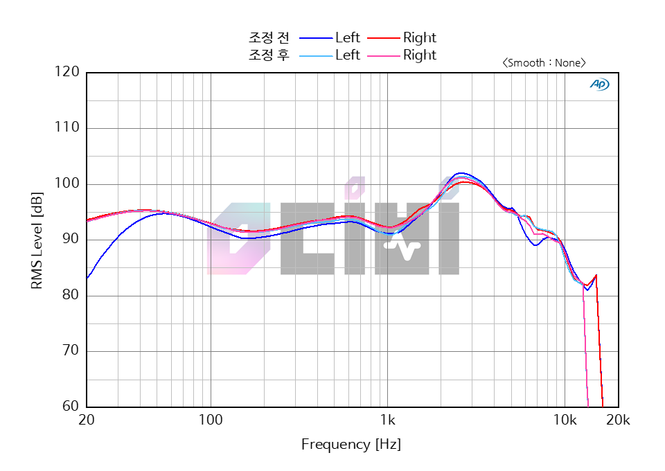

### 세 줄 요약

- Noise cancelling은 별로, Transparency는 정말 좋음
- 음질은 기대하지 말 것. 그러나 당신이 막귀라면 잘 못 느낄 것이다. (적응형 EQ 때문)
- 애플 기기와 같이 사용했을 때 놀라운 사용성을 보여줌. 

---

### 서론

Airpods Pro가 발매되었다. 공개는 10월 29일에 되었기에 11월 29~30일이 발매일이 될 것이라는 예상도 있었으나, 13일에 정식으로 출시되었다. 정발되기 전에는 반응이 미지근 했던 것 같은데 정발 이후에 갑자기 반응이 좋아졌고, 나는 11월 18일에 구매했는데 평일임에도 불구하고 사전 결제 이후 픽업을 하는 사람들이 줄을 서서 제품을 받아갔을 정도였다. 

`새롭게 귓가를 찾아온 매혹` 이라는 소개와 함께 출시된 Airpods Pro는 에어팟 시리즈 중 최초의 커널형 제품이다. 또한 이번 제품부터 Active Noise Cancelling(이하 ANC)과 Transparency mode 가 추가되었다. 개인적으로는 나는 이번 에어팟이 첫 에어팟이기에 이전 시리즈들과는 비교가 힘들어서 Airpods Pro의 장단점 및 다른 ANC/Transparency 지원 헤드폰과 비교해 보는 글을 남긴다.

### 박스 구성 및 개봉

박스를 열면 크게 에어팟 본체 및 케이스, 충전 선, 추가 이어 팁, 그리고 라이센스 문서가 들어있다. 케이스의 충전 단자는 역시나 라이트닝이며, 이전 시리즈들과는 다르게 무선 충전 가능한 버전만 출시되었다. 

Airpods Pro를 사용하기 위해 권장하는 최저 iOS 버전은 13.2다. 나는 13.2로 이미 버전을 올려둔 상태에서 리뷰를 진행한다.

휴대폰의 Bluetooth가 켜진 상태에서 케이스를 열면 바로 최초 페어링 과정이 진행된다. 페어링하면 간단한 사용법을 안내하며 시리 등의 기본 설정 과정을 거친다. 이 과정이 끝나면 에어팟을 바로 사용할 수 있다.

### 성능

에어팟 2세대에 적용된 H1칩이 이번 에어팟 프로에도 적용되었다. 이를 바탕으로 에어팟 프로는 아이폰과 빠르고 안정적으로 연결하며, 음성으로 시리를 부를 수 있는 강력한 사용성을 가지고 있다. 그리고 스피커 드라이버가 조금 더 커졌으며, 적응형 EQ 기능을 제공하여 귀 내부 형태에 맞춰 최적의 음질을 찾는다고 한다. 나는 조금 의아하지만, 실제로 frequency response graph가 Fit test 전후로 조금씩 변하는 케이스가 있다.

- 출처: https://www.0db.co.kr/REVIEW_0DB/1017408

ANC: 개인적으로 기대를 거의 하지 않았고, 정말 기대대로 나왔다. ANC의 완성도 자체는 꽤 높다. 중저 주파수의 지속적인 소음을 잘 차단하기 때문에 걸어다니면서 음악을 듣는 과정에서 잡음들이 꽤 잘 필터링 되는 것을 느끼기 쉽다. 그러나 고주파수 소음 처리에 많이 미약하다. 그렇지만 아이폰과의 높은 호환성으로 인한 사용성을 생각하면 이는 충분히 감안할 수 있다. 

Transparency mode: ANC와 마찬가지로 거의 대부분의 노이즈 캔슬 헤드폰이 제공하는 기능이며, 목소리 등의 소리에 해당하는 주파수 범위를 들을 수 있게 해준다. Transparency mode도 ANC와 마찬가지로 거의 기대를 하지 않았지만, 이번에는 반대로 굉장히 훌륭한 성능을 보여준다. 개인적으로 내가 써본 Transparency mode중 Top 3안에 들어갈 것이다. 소리가 굉장히 자연스럽게 들리고 일상생활에 전혀 무리가 없다. 하루종일 에어팟을 착용한 상태로 일을 해도 직장 동료들과의 커뮤니케이션에 전혀 문제가 없을 정도이다. (배려해 주셔서 감사합니다..)

음질: Noise cancelling이 활성화 된 상태에서는 소리가 플랫하게 느껴진다. NC를 비활성화 하면 저음이 약간 더 올라오는 느낌을 받는다. 그러나 공간감은 여전히 잘 커버가 안 되며, 10k이상 고음역은 소리가 많이 부족하다고 느껴진다. 마치 음질이 낮은 음원처럼 갈라져서 들리는 현상이 있어 보인다. 

착용감: 커널형 이어폰임에도 불구하고 착용감이 꽤 편안하다. 귀에 꽉 끼는 느낌이 들지 않고, 그렇다고 귀에서 흘러내릴 것 같은 느낌도 들지 않는다. 착용한 채로 머리를 흔들거나 해도 느낌에는 별 차이가 없다. 커널형 이어폰을 싫어하는 사람이 아니라면 모두가 즐겁게 착용할 수 있을 것이다.

### 다른 기기와의 비교

가장 많이 비교가 되는 제품은 QC30이나 WF-1000XM3이다. 둘 다 와이어리스 이어폰이고 Noise cancelling 기능을 제공한다. Airpods의 Noise cancelling 성능은 이미 평가를 안 좋게 했듯이 QC30과 WF-1000XM3의 Noise cancelling이 더 좋다. 쉽게 생각해서 가격대가 좀 나간다 하는 다수의 이어폰, 헤드폰은 Airpods pro 보다 Noise cancelling 성능이 좋을 것이라 생각해도 좋다.

그러나 Transparency mode (Ambient sound mode)는 전혀 꿇리지 않는다. 오히려 대다수의 헤드폰 제품들보다 Airpods pro의 Transparency 모드를 나는 더 좋게 평가한다. 일상생활에 전혀 지장이 없으면서 음악은 음악대로 잘 챙길 수 있는 경험은 Airpods가 제공하는 가장 최고의 경험 중 하나이다.

그리고 Bose 제품의 경우 동시에 두 개의 기기에 연결을 해 두고 번갈아가며 소리를 들을 수 있었으나 Airpods Pro의 경우 휴대폰과 맥북을 같이 사용하려면 수동으로 페어링을 계속 변환해 주어야 한다. 이 점까지 챙겨줬으면 정말 좋았겠지만 아쉽게도 이건 포기해야 한다.

### 마지막으로

높은 가격 때문에 Airpods Pro를 살 지 상당히 고민이 될 것이다. 개인적으로 `가격 값은 한다`고 평가한다. 하지만 애플의 다른 제품이 있으며 아니거나 이미 사용하고 있는 성능 좋은 블루투스 이어폰 또는 헤드폰이 있다면 전혀 고려할 필요 없다고 본다. 음질이 압도적으로 좋은 것도 아니고, 애플 기계 이외의 다른 기계에서도 애플의 기계처럼 높은 사용성을 보장하지도 않는다. 가격을 생각한다면 당연한 얘기겠지만 Airpods Pro 도 결국 적당한 선택지 중 하나일 뿐 최고의 선택지는 아님을 생각한다면 구매 욕구가 사라질 사람이 많을 것이다.
