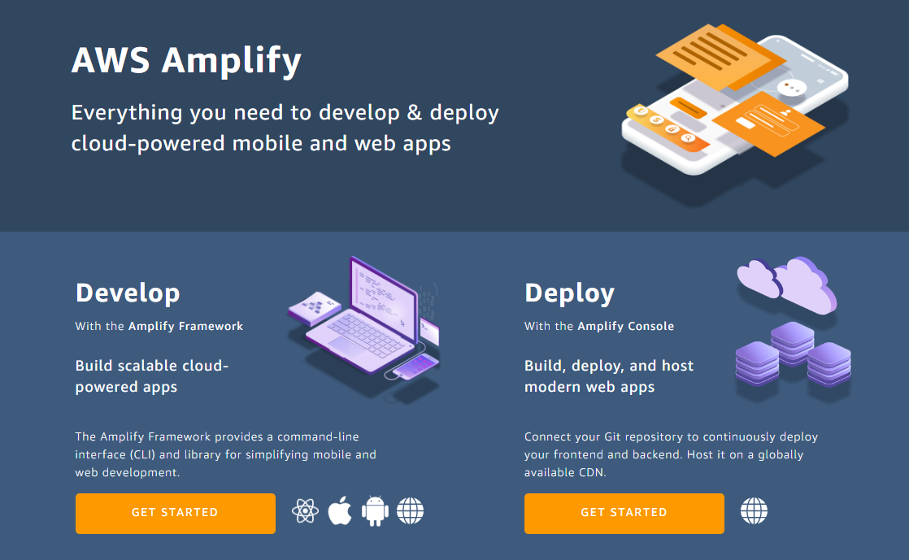
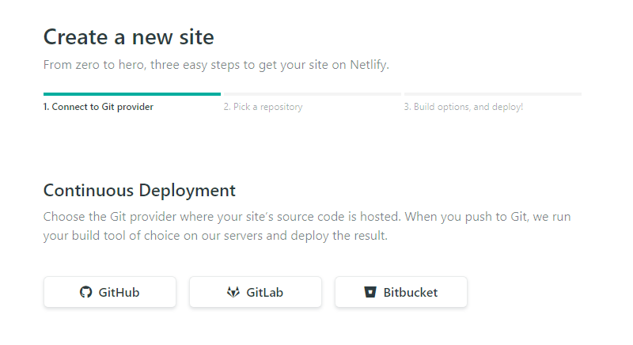
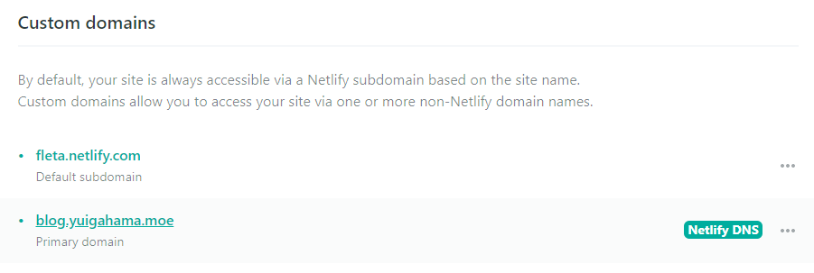

이전 글에서는 Gatsby가 무엇인지 아주 대충 알아봤다. 이번 블로그에서는 내가 이 블로그를 어떻게 세팅했는지 기록한다.


---


## 1. 개발환경 세팅

Gatsby 템플릿을 하나 사용한다. 나는 [gatsby-starter-bee](https://github.com/JaeYeopHan/gatsby-starter-bee) 템플릿을 사용했다. 포크해서 따로 repository를 관리하고 있다. fork한 뒤에는 아래처럼 개발환경을 세팅할 수 있다.

```
npx gatsby new ${directory_name} ${repo_link}

cd ${directory_name}
yarn start
```

yarn을 사용할지 npm을 사용할 지는 `gatsby new` 진행 중에 물어보니 선택할 수 있다.

## 2. 개인정보(?) 수정

- `gatsby-meta-config.js` 파일에서 내 정보를 수정할 수 있다. title, description, author, introduction 등 블로그 전반에 대한 정보를 수정할 수 있다. 나는 comment로 utterances를 사용하고 있는데, utterance같은 경우 app 설치가 필요하다. https://utteranc.es/ 를 참고하자.

- `package.json`에서 일부 항목을 수정할 수 있다.

- `/content/assets` 에 있는 프로필 사진 및 favicon 사진을 수정할 수 있다. favicon 파일 이름을 felog가 아닌 다른 이름으로 하고 싶다면 `gatsby-meta-config.js` 에서 `icon` 항목의 내용을 수정하자.

- `/static` 에서 favicon과 robots.txt를 수정할 수 있다. 

- author name을 눌렀을 때 연결되는 resume page를 수정하고 싶다면 `/content/__about` 에 있는 resume를 수정하자. `resume-en.md`는 기본적으로 있어야 하는 것으로 보인다. 싫다면 `/src/pages/about.js` 의 line 10~12를 수정하는 것으로 변경할 수 있어 보인다. (아직 안 만져봄)

## 3. 배포

### 1. AWS Amplify + AWS Route 53

처음 생각했던 배포 방법은 AWS Amplify이다. github과 연결하여 CD를 구축하는게 가능한 서비스이다. 



AWS Amplify 메인 페이지는 위와 같은데, Deploy 항목에서 GET STARTED를 누르는 것으로 시작할 수 있다. Github 등으로 이미 repository를 관리하고 있다면 연결하기만 하면 끝이다. 연결이 완료되면 remote에서 gatsby project가 빌드되며 페이지에 접근할 수 있는 링크를 받게 된다. 

개인 도메인을 사용해서 AWS Amplify 서비스를 호스팅 하고 싶다면 AWS Route 53을 통해 쉽게 연결할 수 있다.그냥 진짜 캡쳐가 필요없을 정도로 화면에 보이는 `딱 봐도 이거 같다` 클릭 한 두번 하면 알아서 DNS, SSL 설정을 자동으로 해 준다. 

위의 두 개 과정을 합쳐서 약 10분 정도 소요되었음. (배포 및 DNS 설정 적용 완료까지)

그러나 이 세팅 방법에는 딱 하나 단점이 있는데, 바로 비용이 든다는 것이다. 프리티어가 있다면 개인 블로그를 운영할 정도의 빌드 시간 및 호스팅 용량은 충분히 받지만 프리티어가 없다면 얼마 안되는 돈이지만 그래도 돈을 내야 한다. 얼마를 내야 하는지는 [링크(AWS Amplify Console pricing)](https://aws.amazon.com/ko/amplify/console/pricing/)를 참고하여 계산해보길 바람.  

### 2. Netlify

물론 Amplify + Route 53으로 써도 큰 금액을 내는 게 아니다. 그렇지만 돈을 아예 안 낼 수 있는 방법이 있다면 그쪽을 선택하는게 더 합리적일 것이기에 Netlify 로 옮기기로 했다. 

배포 자체는 Amplify에서 하던 것과 비슷하게 진행하면 된다. [Netlify hompage](https://www.netlify.com/)에 접속해서 Log in 또는 Sign up을 하고 Create a new site 단계로 가면 된다. 그러면 아래와 같은 화면을 볼 수 있는데, 그냥 그대로 진행하면 된다. 배포가 완료되면 AWS Amplify와 마찬가지로 도메인을 하나 받게 된다. 도메인 가운데에 들어가는 임의의 이름이 마음에 들지 않는다면 domain setting에서 general 항목에 보면 Site information 항목이 있을 것이다. 여기서 Change site name 기능을 통해 바꿀 수 있다.



Custom domain을 세팅하고 싶으면 마찬가지로 domain setting을 확인하면 된다. Domain management 항목을 보면 Custom domains 항목이 있다. 여기에서 Netlify DNS를 추가할 수 있다. 추가하고 SSL 세팅까지 한번에 할 수 있으므로 메뉴를 따라 진행하면 된다. 만약 추가하고도 TTL이 지났는데도 링크 연결이 제대로 안 되었다면 DNS 설정을 관리하고 있는 플랫폼에서 같은 도메인을 대상으로 설정한 값이 있는지 확인하고 적절히 조치(삭제 등)하면 된다. 아래와 같이 나오면 됨. 



`fleta.netlify.com` 이 netlify 기본 도메인에서 이름만 바꾼 것이고, `blog.yuigahama.moe`가 내가 적용한 커스텀 도메인이다.

## 4. 마무리

사실 이번 블로그는 다른 분이 만들어주신 repository를 그저 fork해서 설정값만 변경하고 포스트만 추가한 복붙 블로그이다. 이후에 Gatsby를 사용하든 아니면 다른 플랫폼을 사용하든 비슷하게 정적 사이트를 만드는 블로그를 만들어 볼 기회를 가지고 싶다. (아마 병특 끝난 이후 잠깐?) 그 때는 세팅 후기 뿐만 아니라 개발 후기도 같이 작성할 수 있는 기회가 되길 바란다.